# 计费页手机版逐屏审计

审计日期：2026-07-13  
范围：订阅套餐、充值、用量明细、余额流水  
用户目标：原生 Compose 保持 Web 手机版的信息架构和视觉层级，同时让窄屏阅读、列表动画和缓存加载优于 Web。

## 总体结论

四标签的入口、概览和内容层级已与 Web 手机版对齐。修改前的核心偏差集中在充值横向裁切和流水裸行；修改后均已消除。用量明细没有机械复制 Web 在 360px 下已裁掉费用列的表格，而是保留同一信息层级并使用原生卡片，属于有证据的窄屏适配。

## 1. 订阅套餐：健康

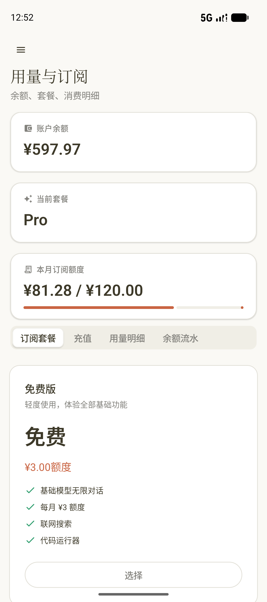
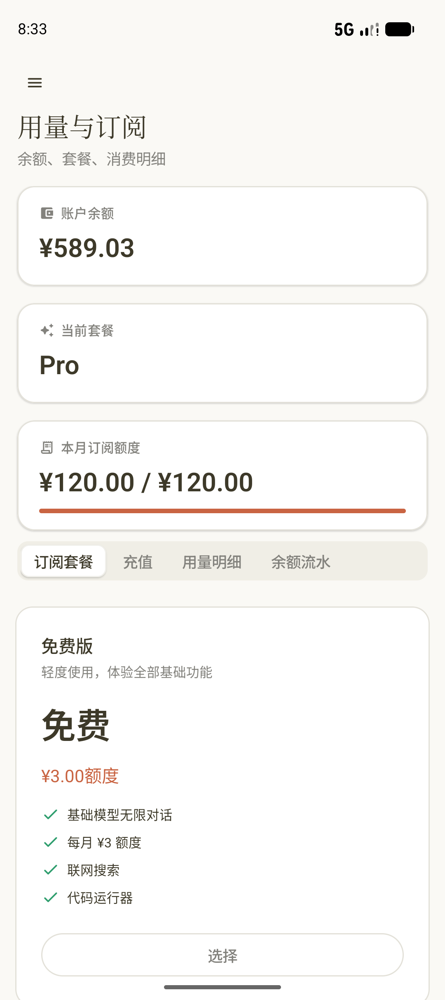

- 三张概览卡、四标签和套餐卡顺序与 Web 一致，真实账号内容完整显示。
- 修改后额度进度不再出现 Material 3 默认终点圆点；满额状态连续填满，数值变化使用原生弹簧动画。
- 套餐选择按钮触摸目标足够大；本轮没有点击任何套餐。

## 2. 充值：由明显偏差修正为健康

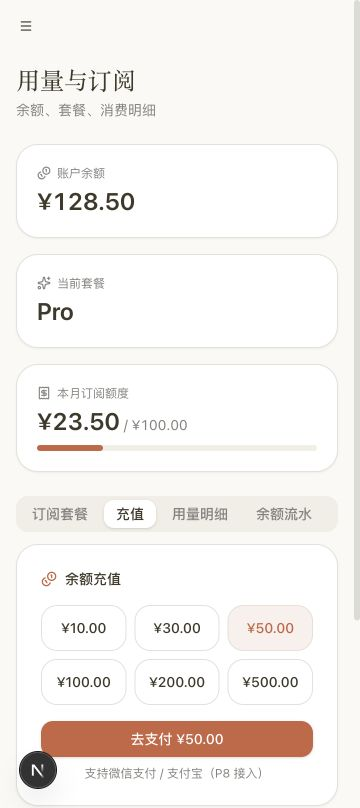
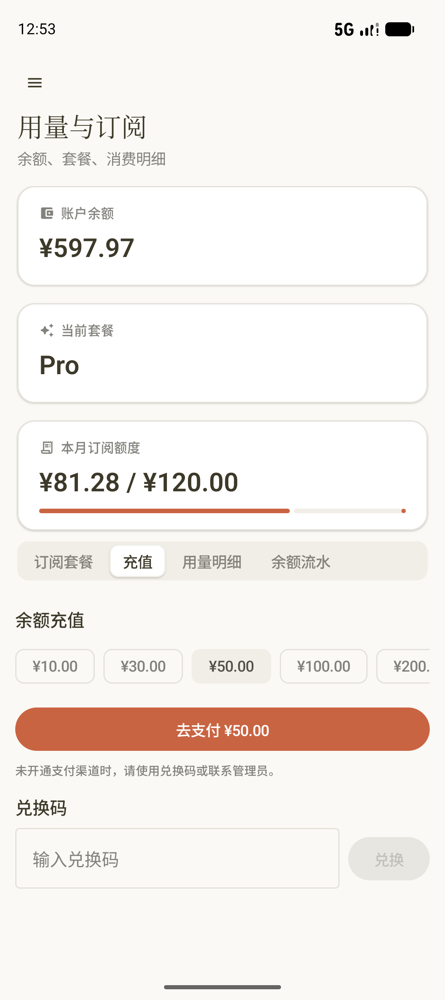
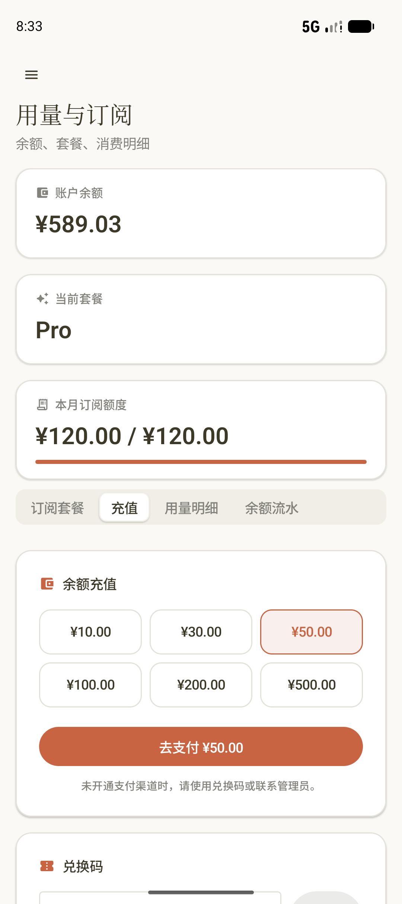
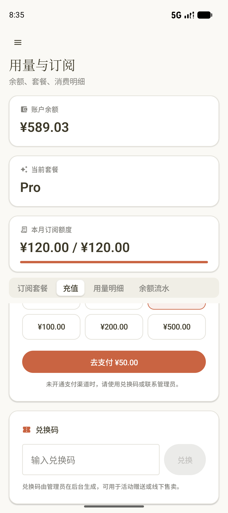

- 修改前金额使用横向列表，¥200 和 ¥500 在首屏被裁切；充值与兑换也缺少 Web 的独立卡片层级。
- 修改后六个金额固定为三列两行，余额充值与兑换码各自位于 16dp 圆角、边框和轻阴影卡片中。
- ¥50 选择态有边框、底色和语义状态，颜色切换使用原生插值；设备切到 ¥10 后已恢复 ¥50。
- 兑换卡补齐“管理员后台生成”说明和键盘完成动作。支付提示保留真实生产语义，没有照抄 Web mock 的 P8 占位文案。
- 本轮没有点击“去支付”，没有输入或提交兑换码，因此没有产生订单或余额写入。

## 3. 用量明细：健康，有意保留窄屏原生卡片

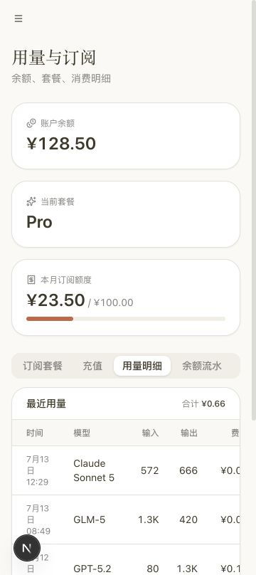
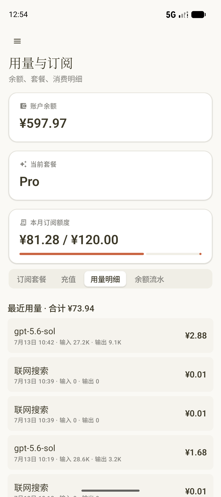
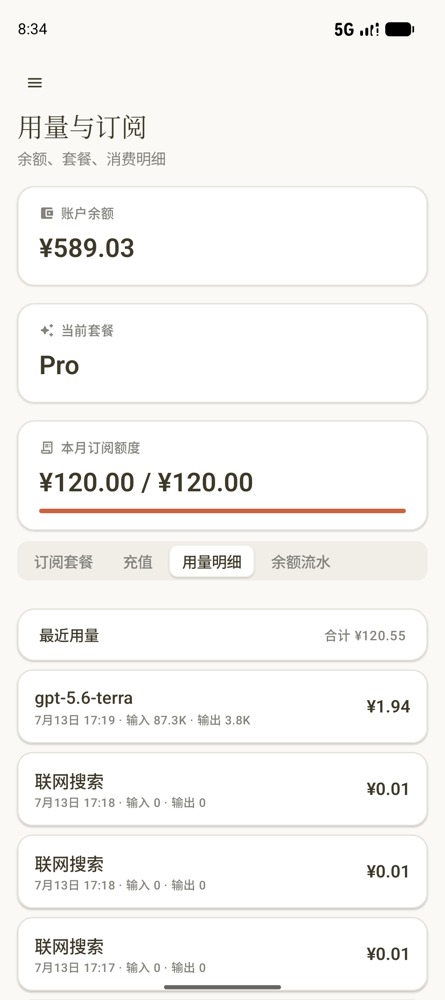

- Web 的“最近用量 / 合计”头部已还原为独立摘要卡，模型、时间、输入、输出或图片数、费用的阅读顺序不变。
- 每条记录改为带边框、轻阴影和 14dp 圆角的 Surface，并保留 `LazyColumn`、稳定 key 和 `animateItem`。
- Web 参考图在 360px 下已裁切费用列；原生卡片让费用始终可见，因此不复制该缺陷。
- 空列表已有带说明的原生空状态，但本轮真实账号有记录，空态只由源码和单测间接覆盖，未形成设备截图。

## 4. 余额流水：由明显偏差修正为健康

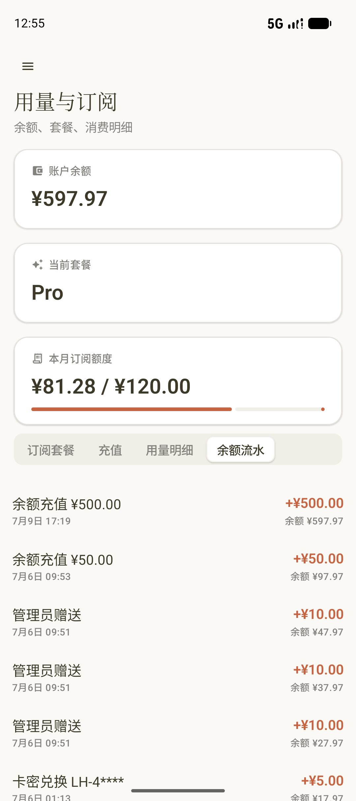
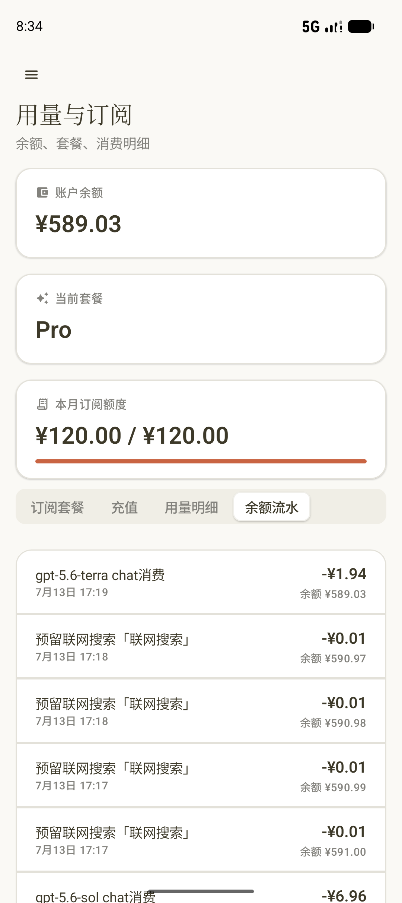

- 修改前为裸行和大段空白，缺少 Web 的统一外框与分隔线。
- 修改后首行、普通行和末行形成连续分段卡，描述、时间、金额和余额在真实长列表中均未裁切。
- 列表仍由 `LazyColumn` 虚拟化，并为变化提供稳定 key 和 `animateItem`，没有把全部流水塞进一次性 Column。

## 可访问性与证据限制

- 截图可确认 360dp 宽度下没有横向裁切、金额按钮达到 46dp 高度、费用与余额均可读；语义树确认四标签、输入框、按钮和真实条目可访问。
- 截图不能证明完整 TalkBack 阅读顺序、200% 动态字体、真机颜色对比或减少动画设置下的全部状态；这些仍需 API 35+ 真机专项复验。
- Web 使用官方 mock 的 360×808 视口；原生为 1080×2424、约 360dp 宽的 Pixel 9 AVD，并包含系统状态栏和手势栏。两端账号数据不同，不据此比较金额或记录数量。
- 支付渠道未做写入 E2E；这也是计费功能仍标记为 `PARTIAL` 的唯一主要业务缺口，本轮不以视觉验证替代真实支付验收。

## 验证

- `BillingPresentationTest` 覆盖三列金额分组、单行及首/中/末流水位置和非法输入。
- `testDebugUnitTest`、`lintDebug`、Debug APK、R8 Benchmark APK 与 Benchmark 测试 APK 全部通过。
- 设备固定为 Android Studio Pixel 9 AVD `emulator-5554`；飞行模式保持关闭，SurfaceFlinger 使用 Apple M5 宿主 GPU。
