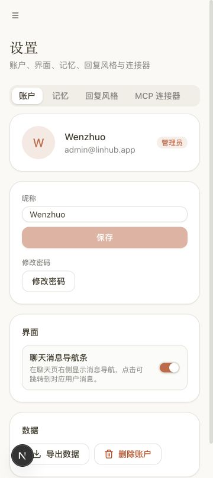
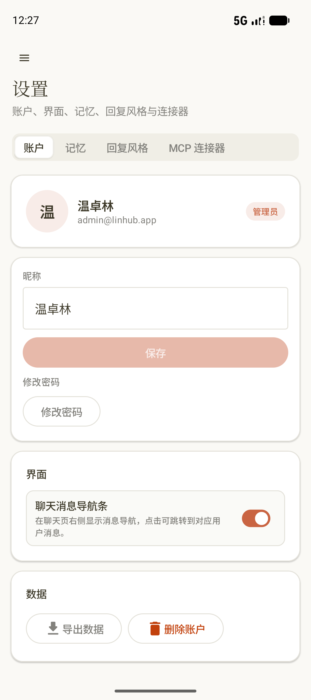
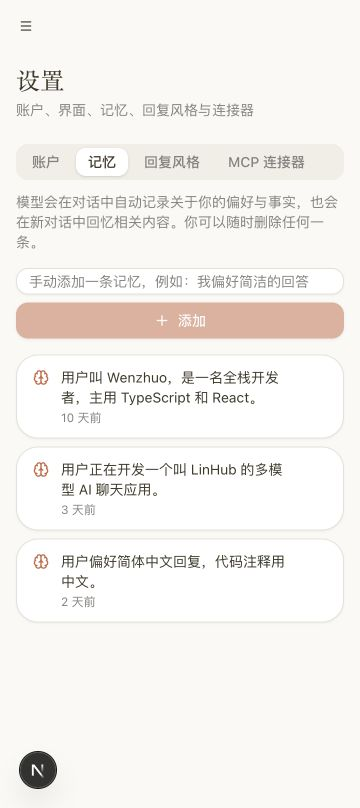
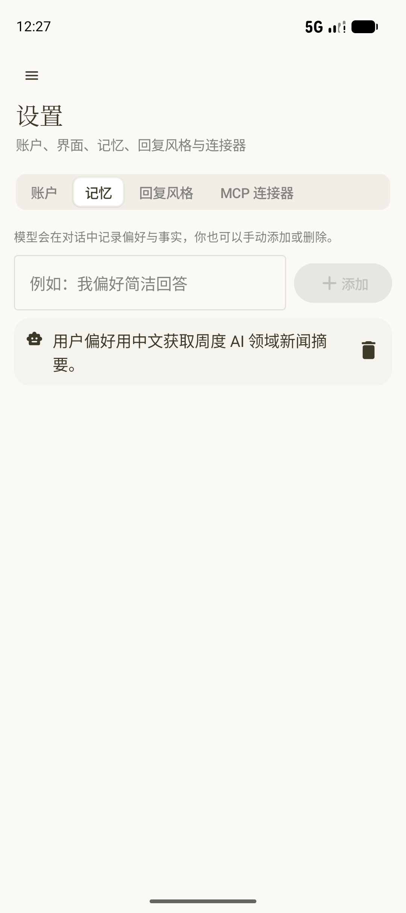
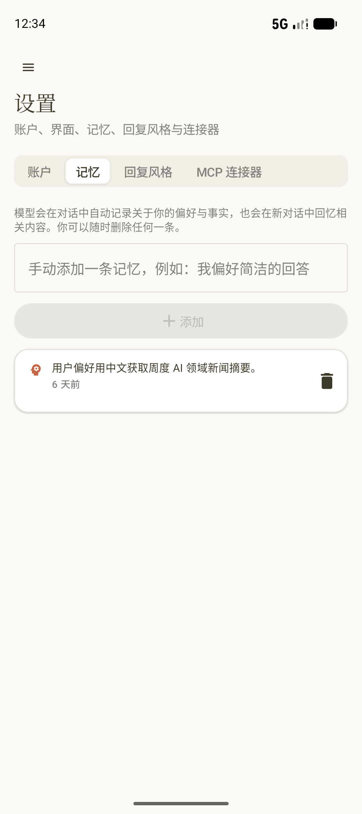
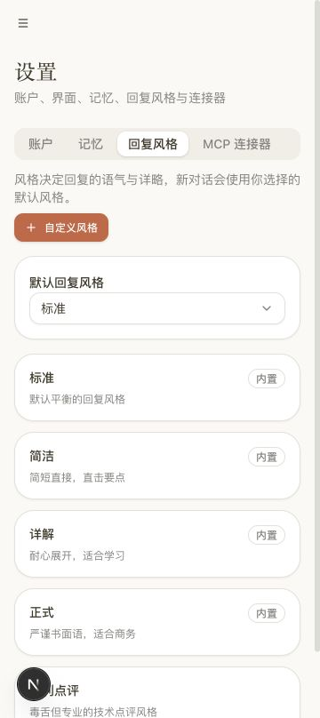
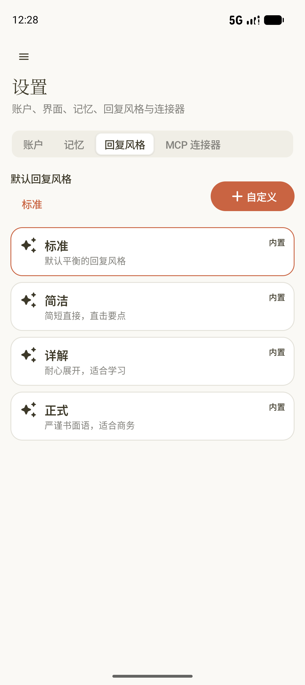
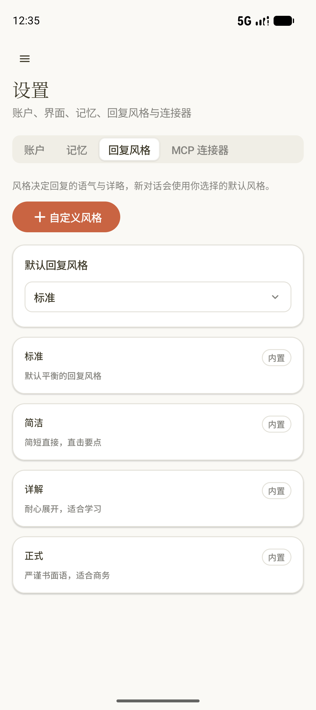
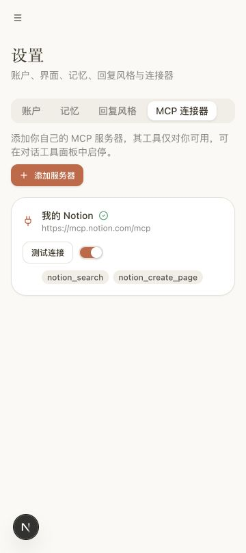
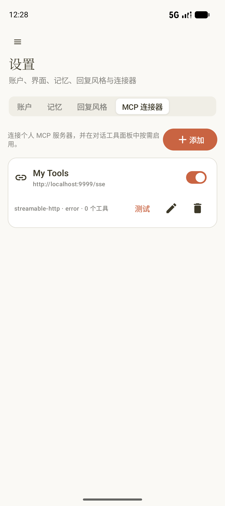

# 设置手机版逐屏审计

审计日期：2026-07-13  
范围：账户、记忆、回复风格、MCP 连接器  
目标：原生 Compose 保持 Web 手机版的信息架构与视觉层级，同时保留触摸目标、缓存和原生动画优势。

## 1. 账户：健康

- 头像、身份、昵称、界面和数据四区顺序一致。
- 原生按钮与开关触摸区域更大，没有改变 Web 的层级。
- 本轮未修改该页。

## 2. 记忆：由明显偏差修正为健康

- 修改前输入框和添加按钮横排，记忆卡缺少时间，且卡片层级弱于 Web。
- 修改后采用纵向输入与全宽添加按钮，补齐 Web 文案、空状态、脑图标、卡片边框、阴影和相对时间。
- 删除按钮提供包含记忆摘要的语义标签；删除确认只打开后取消。

## 3. 回复风格：由明显偏差修正为健康

- 修改前缺少说明文字和默认风格选择卡，默认项用高亮边框代替 Web 的选择器。
- 修改后补齐说明、自定义风格入口、全宽默认选择器和紧凑样式卡，移除卡片内多余装饰图标。
- 默认菜单、自定义弹窗均完成打开后关闭；没有写回默认风格或创建数据。

## 4. MCP：主结构健康，保留原生操作优势

- 两端都有说明、添加入口、名称、URL、开关、连接测试和工具状态。
- 原生把编辑、删除与状态长期显示，触屏下比 Web 的悬停操作更可发现；卡片因此略高，属于有意的原生差异。
- 本轮未触发测试、开关、编辑或删除。

## 可访问性与证据限制

- 截图可确认文字未裁切、控件间距和触摸目标；语义树确认记忆删除按钮包含具体记忆摘要。
- 截图不能证明完整 TalkBack 阅读顺序、动态字体 200% 或真机颜色对比，仍需 API 35+ 真机专项复验。
- Web 使用官方 mock 数据，原生使用远端真实账号，因此条目数量和内容不同；本轮只比较同一组件结构与交互层级。
